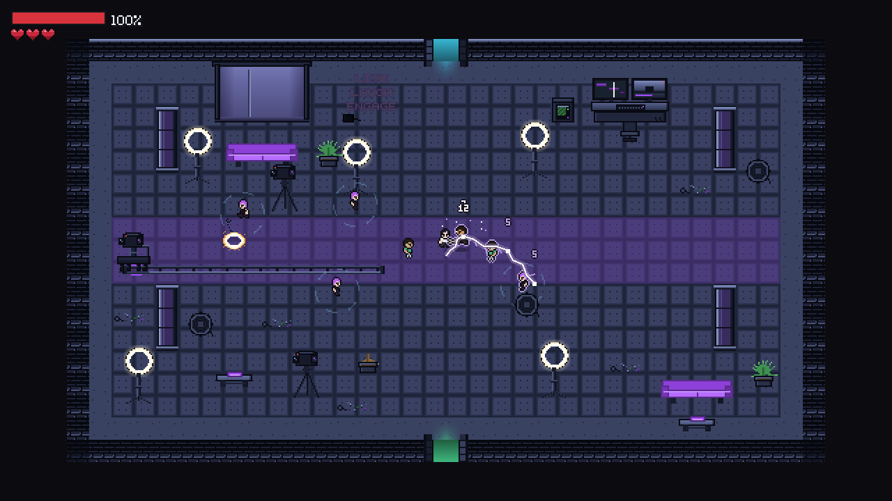
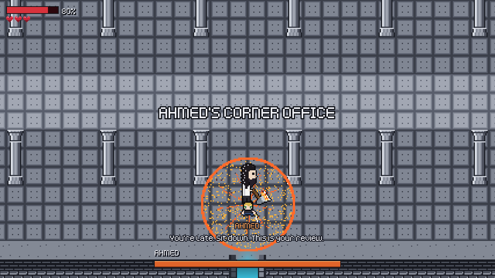
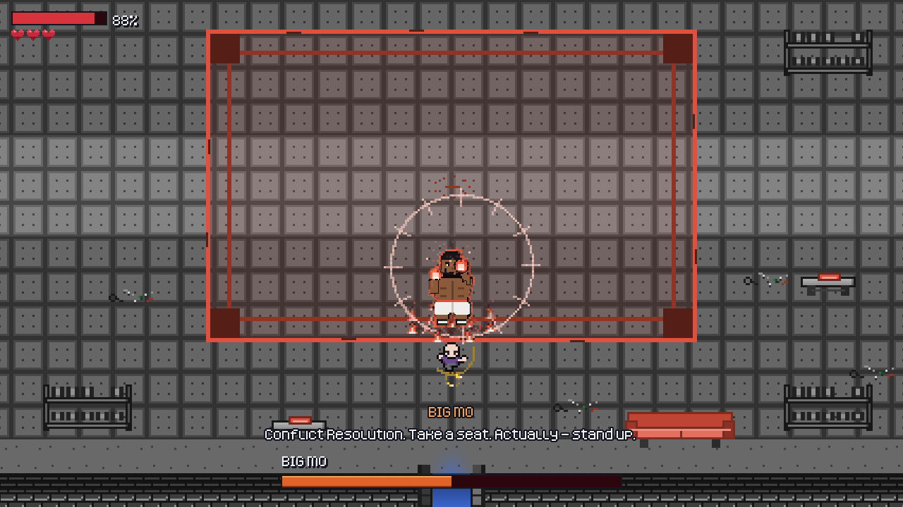
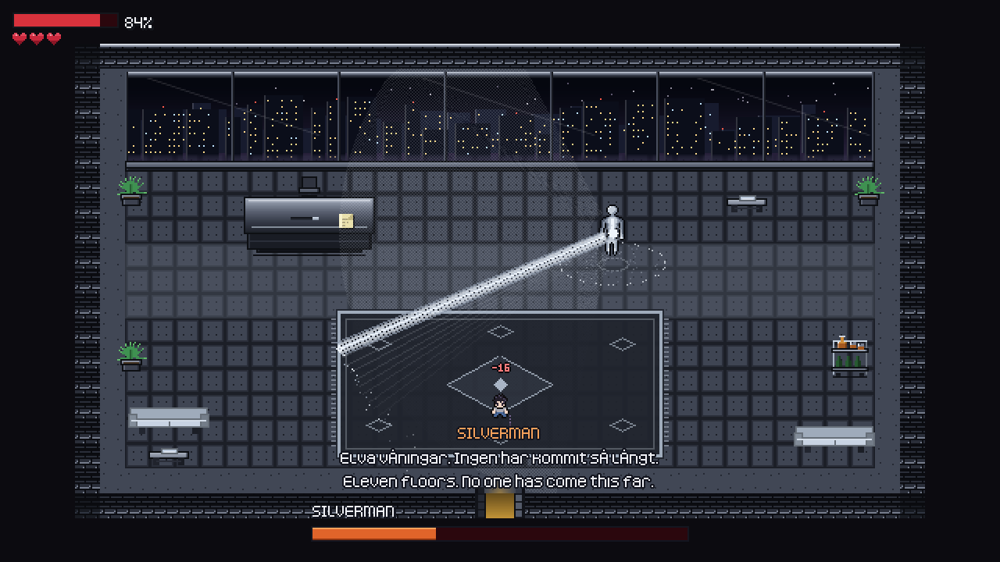

# ZA COMPANY — *The New Hire*



> First day at the company. Your laptop connects to nothing. The WiFi password
> changes every week, and the only person who knows it is Silverman — top floor,
> calendar booked until 2031.
>
> So you take the stairs.

A top-down pixel-art brawler about climbing your own office building, one floor
at a time. Twelve floors, three bosses, ten playable colleagues and a lot of
affectionate workplace comedy: the people in this building are real coworkers,
and the jokes stay warm.

Built in **Godot 4.7**, 640 × 360 and pixel-snapped.

## The bosses

<table>
  <tr>
    <td width="33%"></td>
    <td width="33%"></td>
    <td width="33%"></td>
  </tr>
  <tr>
    <td><b>Ahmed</b>, floor 4. A flaming axe and a different attack for every range. Keep your distance and he throws the chair.</td>
    <td><b>Big Mo</b>, floor 8. A boxer with a rhythm: jab, jab, then a hook <i>or</i> an uppercut, which want opposite answers. At half health he catches fire and doesn't stop.</td>
    <td><b>Silverman</b>, floor 12. Three phases, each one adding a mechanic and taking an interrupt away. He says everything twice: in Swedish, then in English.</td>
  </tr>
</table>

## What's in it

- **Twelve floors, each a different room.** The Lobby, The Content Studio,
  The Call Center, Ahmed's Corner Office, The Hub, The Marble Hall, The
  Innovation Lab, Conflict Resolution, Asset Recovery, Hellfire, The Executive
  Floor and Silverman's Office. They come in different shapes: an L, a long hall, a
  cross, and an S of three stacked halls. Some keep their own hazard: the
  studio's ring lights and camera dolly run on a shooting clock, the call
  center's wiring fires in sequence, and the hub's machines wander.
- **A three-hit combo that ends in lightning.** A swing, a rising slash, then an
  arc that jumps to the nearest enemy and once more from there. Hold the button
  for a charged heavy instead. Hits pause the action for a moment, flash the
  target white and show the damage done.
- **Enemies that each take something different.** Office boys hit you. The
  social media team drains your health. The call center slows you down.
  Security slams the floor and throws you across the room.
- **Rooms with an arrangement, not waves.** Every enemy is placed, the walk
  between the doors starts out clear, and reinforcements arrive by the doors at
  set moments. Once a room is clear, nothing respawns while you're in it.
- **The people who help.** HR runs your induction. Ivo walks in after the big
  fights and throws you a heart. Domimi comes down from the floor above to warn
  you about whoever is waiting up there.
- **Voiced.** All three bosses, HR, Ivo and Domimi speak their lines, and two of
  the teams mutter to themselves while they work.
- **Three difficulties.** Easy, Medium and Hard change how much damage you take
  and how long you're safe after a hit. Enemy health is the same on every mode,
  so a guard always dies to exactly three hits.

## Running it

1. Install [Godot 4.7](https://godotengine.org/download).
2. Open `project.godot` in the editor and press **F5**.

The game launches in a 1920 × 1080 window, an exact 3× of the base resolution.

## Developing

The two documents to read first:

- [`CLAUDE.md`](CLAUDE.md) covers **how** things work: the structure, the rules
  that hold the game together, and the gotchas.
- [`DESIGN.md`](DESIGN.md) covers **what** to build: the story, the floors,
  the bosses, the ending, and the build-order checklist.

Most of the game is generated from data rather than built by hand: floors,
furniture, tilesets, character sheets and the UI theme all come from scripts in
`tools/`. Run them from **Project > Tools > za-build** in the editor, or
headless (`godot` here is your Godot 4.7 binary):

```sh
godot --headless --path . --script res://tools/build_levels.gd -- lobby
```

The tests drive the real game with synthesized input, with no framework, and
exit 0 or 1:

```sh
godot --headless --path . --script res://tests/run_all.gd                    # every suite (slow)
godot --headless --path . --fixed-fps 60 --script res://tests/test_combat.gd # one suite
```

### Layout

```
game/       gameplay: the player, enemies, bosses, NPCs, levels, dialogue
ui/         one folder per screen
autoload/   global singletons: settings, display, difficulty, music, menu sound
tools/      editor-side generators, run headless; never shipped
tests/      one suite per process, one clean world each
assets/     only files shared across features: fonts, tiles, music
addons/     the za-build menu plugin, and WebRTC for online co-op
server/     the online back end (signaling + TURN, in Docker); not part of the game
docs/       the images on this page
```

## Status

In development. All twelve floors and all three bosses are in. Still to come:
the ending, and online co-op for up to four players (planned in DESIGN.md's
*Multiplayer* section; the server stack is in `server/`).

## Credits

The character, enemy and dungeon art started from CC0 sheets by
**profpatonildo**, and the fonts are **Kenney's** (also CC0). The furniture,
props and bosses are original work drawn in code. The voices, sound effects
and music were generated with ElevenLabs; the menu sounds are synthesized in
code. The full list, with sources and licenses, is in
[`CREDITS.md`](CREDITS.md).
